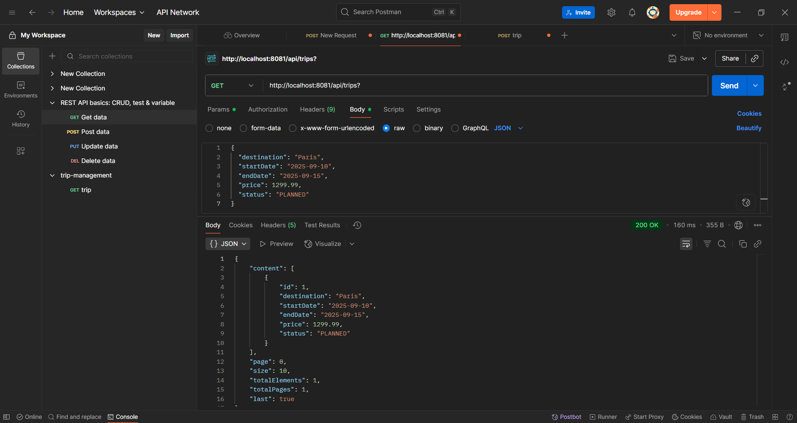
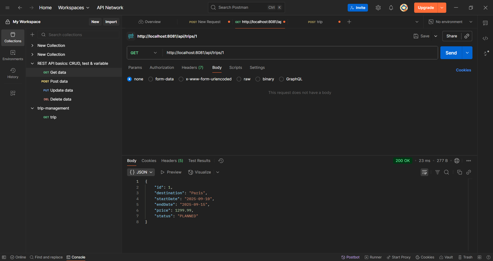
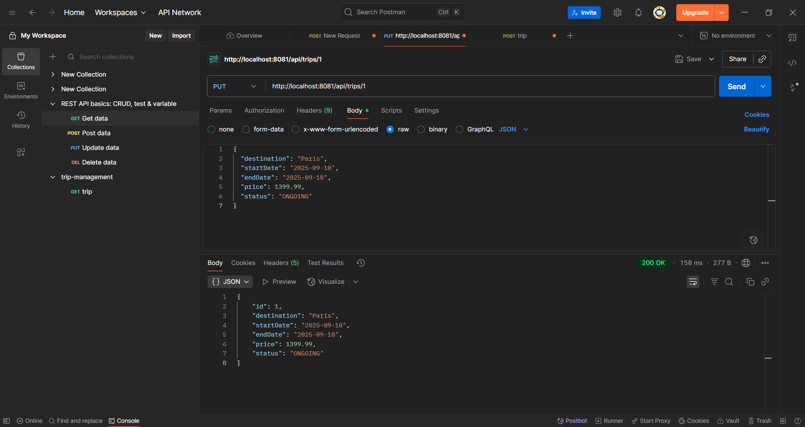
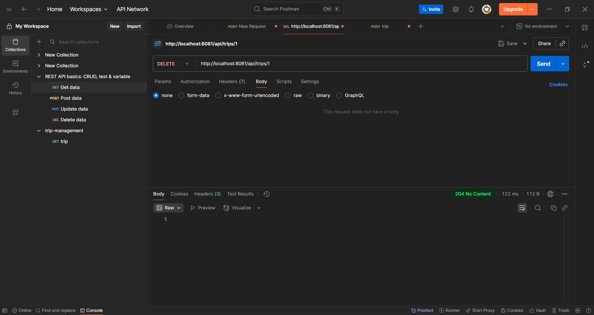
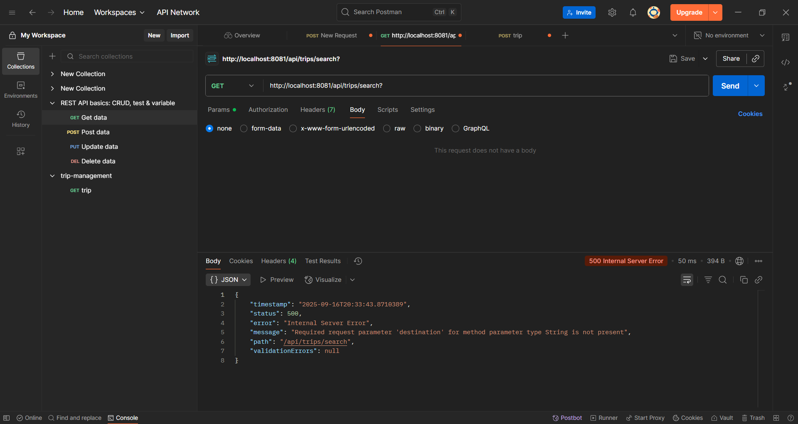
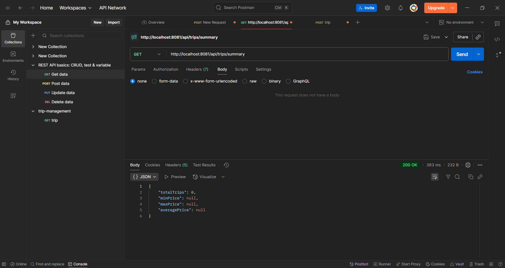

## Objective
Build a Spring Boot application with Hibernate (Spring Data JPA) and MySQL to manage Trips. The system supports CRUD operations, search, filtering, pagination & sorting, custom validations, global exception handling, DTO-based responses, Swagger/OpenAPI docs, and unit tests.

## Tech Stack
- Spring Boot 3.x, Spring Web, Spring Data JPA, Validation (Jakarta)
- Database: MySQL (db name: `tripdb`)
- Build tool: Maven
- API Docs: springdoc OpenAPI (Swagger UI)
- Tests: JUnit 5 + Mockito

## Project Structure (key parts)
- `src/main/java/com/example/tripmanagement`
  - `TripManagementApplication.java`
  - `domain/Trip.java`, `domain/TripStatus.java`
  - `repository/TripRepository.java`
  - `service/TripService.java`, `service/TripServiceImpl.java`
  - `web/controller/TripController.java`, `web/controller/HomeController.java` (redirects `/` → Swagger)
  - `web/dto/TripRequest.java`, `TripResponse.java`, `TripSummaryDTO.java`, `PageResponse.java`
  - `web/mapper/TripMapper.java`
  - `validation/EndDateAfterStartDate.java`, `EndDateAfterStartDateValidator.java`
  - `exception/GlobalExceptionHandler.java`, `NotFoundException.java`, `ApiError.java`
  - `config/OpenApiConfig.java`
- `src/main/resources/application.properties`
- `src/main/resources/tripdb.sql`

## Entity: Trip
Fields and constraints:
- `id` (Integer): Primary Key, Auto-generated
- `destination` (String): cannot be empty
- `startDate` (Date): cannot be null
- `endDate` (Date): must be after `startDate`
- `price` (Double): must be positive
- `status` (Enum): PLANNED, ONGOING, COMPLETED

## How to Run (Windows PowerShell)
1) Prerequisites
   - JDK 17+
   - Maven 3.9+
   - MySQL 8+ running locally
2) Create database (if not present):
   ```sql
   CREATE DATABASE IF NOT EXISTS tripdb;
   ```
3) Configure DB credentials in `src/main/resources/application.properties`:
   ```properties
   spring.datasource.url=jdbc:mysql://localhost:3306/tripdb?useSSL=false&allowPublicKeyRetrieval=true&serverTimezone=UTC
   spring.datasource.username=root
   spring.datasource.password=YOUR_PASSWORD
   spring.jpa.hibernate.ddl-auto=update
   spring.jpa.show-sql=true
   spring.jpa.properties.hibernate.format_sql=true
   # Server port
   server.port=8081
   ```
4) Start the app (and keep this terminal open):
   ```powershell
   mvn spring-boot:run
   ```
5) Swagger UI:
   - `http://localhost:8081/swagger-ui.html` (or `/swagger-ui/index.html`)

## API Endpoints

### 1. Create Trip
- Method: POST
- URL: `/api/trips`
- Body (JSON):
```json
{
  "destination": "Paris",
  "startDate": "2025-09-10",
  "endDate": "2025-09-20",
  "price": 1500.00,
  "status": "PLANNED"
}
```
- Responses:
  - 201 Created: returns created Trip
  - 400 Bad Request: validation errors

### 2. Get All Trips (with Pagination & Sorting)
- Method: GET
- URL: `/api/trips`
- Query Params:
  - `page` (default=0)
  - `size` (default=10)
  - `sortBy` (e.g., `price`), `direction` (`ASC`/`DESC`)
- Example:
  - `GET /api/trips?page=0&size=5&sortBy=startDate&direction=ASC`

### 3. Get Trip by ID
- Method: GET
- URL: `/api/trips/{id}`
- Example: `GET /api/trips/5`

### 4. Update Trip by ID
- Method: PUT
- URL: `/api/trips/{id}`
- Body (JSON):
```json
{
  "destination": "London",
  "startDate": "2025-09-15",
  "endDate": "2025-09-25",
  "price": 1800.00,
  "status": "ONGOING"
}
```

### 5. Delete Trip by ID
- Method: DELETE
- URL: `/api/trips/{id}`
- Example: `DELETE /api/trips/3`

### 6. Search Trips by Destination
- Method: GET
- URL: `/api/trips/search?destination=Paris`

### 7. Filter Trips by Status
- Method: GET
- URL: `/api/trips/filter?status=PLANNED`

### 8. Get Trips Between Dates
- Method: GET
- URL: `/api/trips/daterange?start=2025-09-01&end=2025-09-30`

### 9. Get Trip Summary
- Method: GET
- URL: `/api/trips/summary`
- Example response:
```json
{
  "totalTrips": 50,
  "minPrice": 500.0,
  "maxPrice": 4500.0,
  "averagePrice": 2200.0
}
```

## Testing the API

### Swagger UI (quickest)
- Open `http://localhost:8081/swagger-ui.html`, expand endpoints, click “Try it out”, and execute requests.

### Postman
1) Import via OpenAPI (recommended):
   - In Postman → Import → Link → paste `http://localhost:8081/v3/api-docs` → Import.
   - You’ll get a collection with all endpoints.
2) Manual example – Create Trip:
   - Method: POST, URL: `http://localhost:8081/api/trips`
   - Headers: `Content-Type: application/json`
   - Body (raw JSON): see Create Trip above.

### JUnit/Mockito
- Unit tests scaffold can be added under `src/test/java/...` (e.g., service and controller tests with Mockito). Run:
```powershell
mvn test
```

## Database Script
- File: `src/main/resources/tripdb.sql`
- Contents create `tripdb` and table if you prefer manual creation. The app also auto-creates tables via JPA if `ddl-auto=update`.
##Sceenshot








